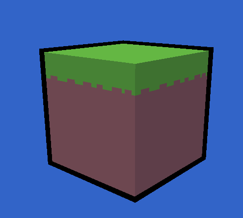

# Voxcell - a voxel engine

This is a series, written as tutorials, as I make a very simple voxel engine. 
I will be using Rust, SDL3's GPU API, and Slang for shaders.
The intention is not to cover graphics programming, [Learn Opengl](https://learnopengl.com/) is a great resource for that.
I also don't intend to teach [Rust](https://doc.rust-lang.org/book/), [Slang](https://docs.shader-slang.org/en/latest/external/slang/docs/user-guide/), or [SDL3](https://wiki.libsdl.org/SDL3/FrontPage).


Each article will cover one major milestone as I learn how to do it myself.
So the true purpose can be considered to learn by teaching.

## Setup

The repository is located [here](https://github.com/tomcmot/voxcell).
To start with [this branch](https://github.com/tomcmot/voxcell/tree/tutorial-0-cube) contains a very simple setup of a cube and camera.
Which I will briefly discuss in this article and is what will be built off in the next article.

I have Ubuntu, Fedora, and a Steam deck; so building for Windows and Mac isn't something I am particularly concerned with.
For Linus users, you should be able to use your package manager to get the developer packages for SDL3.
You will also want to grab a release of [slangc](https://github.com/shader-slang/slang/releases).
I didn't intentionally install Dear ImGui, so I believe cargo will handle that for you.
This section will probably be revisited when I get further along and have something that could be called a game.

## Cube

The rendering pipeline currently does two things: it draws a single cube and it draws an outline.


```rust
//
// outline
//
render_pass.bind_graphics_pipeline(&self.outline);
cmdbuffer.push_vertex_uniform_data(0, camera_buffer);
cmdbuffer.push_vertex_uniform_data(1, &outline_buffer.thickness);
cmdbuffer.push_fragment_uniform_data(0, &outline_buffer.color);
render_pass.bind_vertex_buffers(0, bindings);
render_pass.bind_index_buffer(index_binding, IndexElementSize::_32BIT);
render_pass.draw_indexed_primitives(chunk.indices.len() as u32, 1, 0, 0, 0);
//
// main
//
render_pass.bind_graphics_pipeline(&self.main);
cmdbuffer.push_vertex_uniform_data(0, camera_buffer);
cmdbuffer.push_fragment_uniform_data(0, light_buffer);
render_pass.bind_vertex_buffers(0, bindings);
render_pass.bind_index_buffer(index_binding, IndexElementSize::_32BIT);
render_pass.bind_fragment_samplers(0, tex_samp_bind);
render_pass.draw_indexed_primitives(chunk.indices.len() as u32, 1, 0, 0, 0);

```



The outline is drawn first so the actual cube draws over the top and uses a technique called inverted hull.
It's pretty simple, render the cube slightly larger and cull front faces instead of back faces.
I have left the outline pretty chunky, but if you want to play around with it simply alter the OutlineBuffer's thickness field.

```rust
let obuffer = OutlineBuffer {
    color: Vec3::ZERO,
    thickness: 0.05, // change this
};
```

The only part that's tricky is the normals of the vertices of the cube match the face and not the direction of the vertex.
Thus I instead use the position normalized to determine what direction to expand to, exploiting the fact that the mesh is a cube that is centered on the origin (of its local coordinates).

```glsl
float3 expanded = v.position + normalize(v.position) * thickness;
```

For the cube itself, I made a very simple texture atlas which is stored as a texture array.
This means texture coordinates are 3-dimensional (uvw) instead of the usual 2D (uv), aka the w coordinate is the index into the array. 

```glsl
float3 n = normalize(v.world_normal);
float ndotl = max(dot(n, lightDir), 0.);
float bands = max(bandCount, 1.);
float step = ndotl;
```
The `main.slang` shader does a very simple form of cel-shading, instead of allowing light to be continuous it's broken up into a number of discrete bands.
It also implements a single directional light source, just to distinguish between sides.

## Camera and Controls

The camera is very simple, it is essentially the one developed in Learn OpenGl. 
Just using SDL3 instead of glfw.
You can move with WASD and look around with the mouse.
The ESC key will quit the app.

The camera is needed by both `main.slang` and the `outline.slang`. 
They need to know what direction you are looking in to know which faces to cull and how to map local coordinates to world and screen spaces.

Dear ImGui is used to display an FPS counter.
Since the goal is just to give an idea of relative performance for later steps, I've chosen to keep it as simple as possible.
Which does mean that it is hard to read outside of screenshots.
A more complex implementation would average the values over a longer period, maybe updating 12 or 24 times a second instead of every frame.

I was originally going to use sdl3_ttf but the high level Rust bindings in the sdl3 crate don't support the GPU API yet.
While the low level bindings do exist, I found it took more setup than it was worth for a bit of debug text.

## Next

The first proper article will go on to implement chunks, turning this from a cube into something that can be described as voxels.
I wanted to keep this one short as an introduction to what I'm doing and provide some references for what background you should have to follow along.

